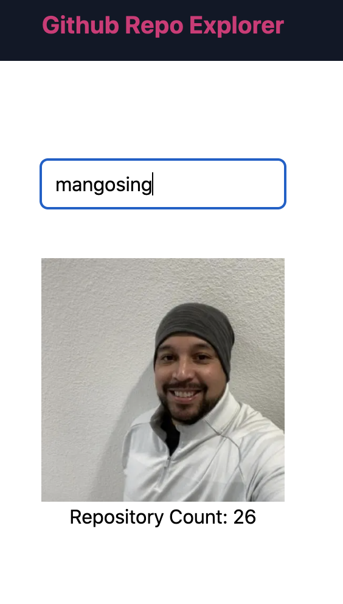
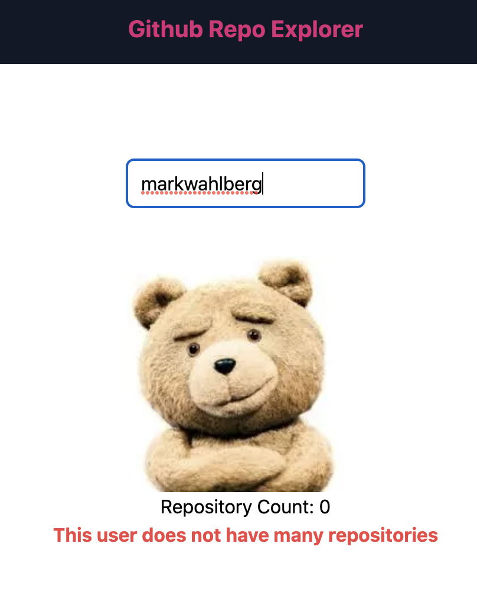

## Getting Started

---

First, install dependencies and run the development server:

```bash
yarn
yarn dev
```

To run tests

```bash
yarn test
```

Open [http://localhost:3000](http://localhost:3000) with your browser to see the result.

You can start editing the page by modifying `pages/index.js`. The page auto-updates as you edit the file.

## TODO

---

This app is broken (surprise).

First you will need a file `.env.local` at the root of this project with your github user access token: `GITHUB_ACCESS_TOKEN=`

To get your github user access token: https://docs.github.com/en/authentication/keeping-your-account-and-data-secure/creating-a-personal-access-token

This app should pull a github user's data from the github graphql API https://docs.github.com/en/graphql and display their avatar and the number of repositories they own.

If they have more than 5 repos:



If they have less than 5 repos:



There are some ui/ux issues as well:

- when a user erases the input completely, no user should be displayed
- we don't want to fire off a request every time a user types a letter - we need to use a debounce method to prevent this
- we should really only fire off a request if there are more than 3 characters as well

You will know your work is done when ALL tests pass `ALL tests should pass.` Good luck!

---

**BONUS**

Add some more tests to ensure that we only make a request when an input has more than 3 characters.
